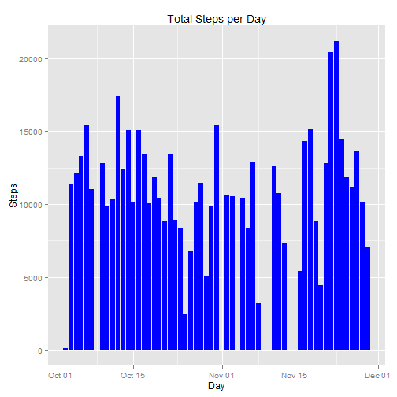
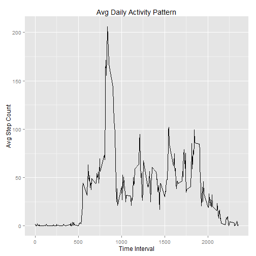
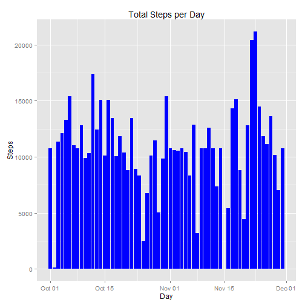
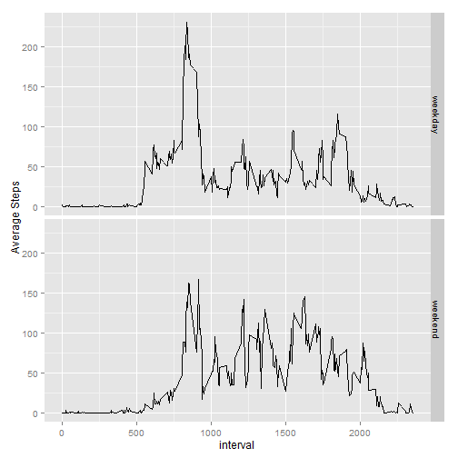

## Loading and preprocessing the data

```r
filepath <- "repdata-data-activity/activity.csv"
rawdata <- read.csv(filepath, header = TRUE, na.strings = "NA")

rawdata$date <- as.Date(rawdata$date)
```


## What is mean total number of steps taken per day?

```r
## For this part of the assignment, ignore the missing values in the dataset.
## Calculate the total number of steps taken per day
DayTotals <- aggregate(steps ~ date, rawdata, sum)

## Make a histogram of the total number of steps taken each day
qplot(x = date,
	  y = steps,
	  data = DayTotals,
      geom= "histogram",
	  stat= "identity",
      main = "Total Steps per Day",
      xlab = "Day",
	  ylab = "Steps",
	  fill=I("blue"))
```

 

```r
## Calculate and report the mean and median of the total number of steps taken per day
ReportMean <- mean(DayTotals$steps)
ReportMedian <- median(DayTotals$steps)
ReportMean 
```

```
## [1] 10766.19
```

```r
ReportMedian 
```

```
## [1] 10765
```


* As seen from the calculations above, mean and median values of steps per day are:  
    + Mean - 1.0766189 &times; 10<sup>4</sup>
    + Median - 10765

## What is the average daily activity pattern?

```r
## Make a time series plot (i.e. type = "l") of the 5-minute interval (x-axis) and the average number of
## steps taken, averaged across all days (y-axis)
IntervalAvg <- aggregate(steps ~ interval, rawdata, mean)
IntervalAvg <- rename(IntervalAvg , c("steps"="AvgSteps"))

ggplot(data=IntervalAvg, aes(x=interval, y=AvgSteps)) +
	 geom_line() +
	 ggtitle("Avg Daily Activity Pattern") +
	 ylab("Avg Step Count") +
	 xlab("Time Interval")
```

 

```r
## Which 5-minute interval, on average across all the days in the dataset, contains the maximum number of steps?
MaxInterval <- IntervalAvg[IntervalAvg$AvgSteps == max(IntervalAvg$AvgSteps),]
MaxInterval[, c(1:1)]
```

```
## [1] 835
```
* As seen from the calculations above, the 5 minute interval with the max number of steps is 835
    
## Imputing missing values
* Strategy for imputing missing values:  
    + Replace any NA value with the average step count for that same interval across all days.  
    + For example if the 630 interval for day 1 contains NA, but the average value for the 630 interval across all other days is 100, replace NA with 100.

```r
## Calculate and report the total number of missing values in the dataset (i.e. the total number of rows with NAs)
sum(is.na(rawdata$steps))
```

```
## [1] 2304
```

```r
## Devise a strategy for filling in all of the missing values in the dataset.
## Use the mean of the 5-minute intervals to replace the NA values.
## Left Join the interval averages to the original raw data using "interval" as the id
JoinedData <- join(rawdata, IntervalAvg)
```

```
## Joining by: interval
```

```r
## Replace the NA's with the Average values for that interval where appropriate
JoinedData$FilledSteps <- ifelse(is.na(JoinedData$steps), JoinedData$AvgSteps, JoinedData$steps)
## Keep only the necessary columns to retain the same format as the original dataset
FilledData <- JoinedData[ , c(5,2,3)]
## Calculate the total steps per day using the "filled" data set
DayTotalsFilled <- aggregate(FilledSteps ~ date, FilledData, sum)

## Make a histogram of the total number of steps taken each day using the "filler" values in place of "NA"
qplot(x = date,
	  y = FilledSteps,
	  data = DayTotalsFilled,
      geom= "histogram",
	  stat= "identity",
      main = "Total Steps per Day",
      xlab = "Day",
	  ylab = "Steps",
	  fill=I("blue"))
```

 

```r
## Calculate and report the mean and median of the total number of steps taken per day using the "filler" data
mean(DayTotalsFilled$FilledSteps)
```

```
## [1] 10766.19
```

```r
median(DayTotalsFilled$FilledSteps)
```

```
## [1] 10766.19
```
* As seen from the calculations above, mean and median values of steps per day (after imputing the NA's) are:  
    + Mean - 1.0766189 &times; 10<sup>4</sup>
    + Median - 1.0766189 &times; 10<sup>4</sup>

## Are there differences in activity patterns between weekdays and weekends?

```r
## Create a new factor variable with two levels -- "weekday" and "weekend" 
FilledData$DayType <- as.factor(ifelse(weekdays(FilledData$date) %in% c("Saturday", "Sunday"), "weekend", "weekday"))

## Make a time series plot of the 5-minute interval (x-axis) and the average number of steps taken, averaged across
## all weekday days or weekend days (y-axis).
DayTypeAvg <- ddply(FilledData, c("interval", "DayType"), summarize, AvgSteps = mean(FilledSteps))
ggplot(data=DayTypeAvg, aes(x=interval, y=AvgSteps)) + geom_line() + facet_grid(DayType ~ .) + ylab("Average Steps")
```

 

* As can be seen from the charts above, the "weekend" steps are less concentrated during the 30 minutes starting at 8:30am and are more evenly distributed throughout the day.
